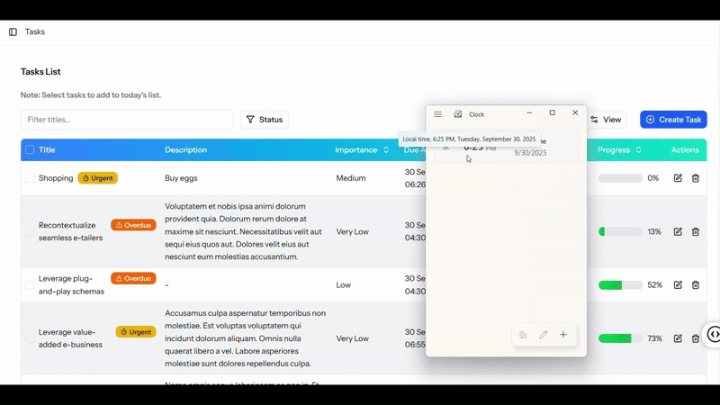

## Introduction
This is a task management system with real-time status update feature in the form of Single Page Application(SPA). The system is named as TaskFlow. It is meant to help users to prioritize tasks into daily to-do lists. Users can get notified through app notifications and mail messsages when their tasks are being urgent or overdue. Therefore, users can take corresponding actions immediately to manage their tasks.

TaskFlow is built with Laravel, Inertia.js, React.js and TypeScript. Real-time features such as detecting whether there are any tasks being urgent or overdue is done using Laravel's Scheduler. It is scheduled for checking for every minute. To broadcast app notification and perform real-time update at the Client side, Laravel Notification, Event and Pusher did a great job. Laravel's Echo is also used in the Client side to listen for the broadcasting events.

## 🚀 Demo
